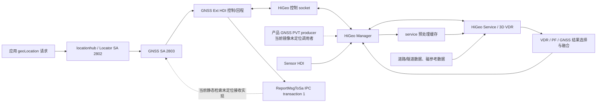

# HarmonyOS 驾车隧道定位机制逆向记录

> 状态：供给镜像的静态机制与采样链已解析；Pura 70 只读运行态已做部分核查，
> 真实驾车/隧道动态验证仍待补，可作为接手入口
> 文档版本：v0.8（2026-08-02）
> 分析对象：HarmonyOS 6.1.1 模拟器镜像，API 24，镜像包版本
> `6.1.0.125`，guest build `HarmonyOS 6.1.0.125(SP9)`
> 镜像目录：
> `$env:LOCALAPPDATA\Huawei\Sdk\system-image\HarmonyOS-6.1.1\phone_all_x86`
>
> 真机核查对象：HUAWEI Pura 70（ADY-AL10），
> `6.1.0.135(SP8C00E120R5P6)` / API 24，AArch64

## 1. 当前结论

供给镜像直接证明 1102a/1106 具备 HiGeo 车辆航位推算与地图约束链；用该链
解释量产机具体隧道行程中的持续定位属于强推断，仍需真机动态验证。该静态
链路不是“保留最后一次 GNSS 速度并沿直线外推”，也不是只对手机加速度
做二次积分，而是组合了：

1. 车辆状态识别：GNSS 速度、运动感知和车辆蓝牙连接存在直接代码证据；
   学习配置与白名单进一步支持蓝牙/Wi-Fi 连接信息参与的强推断，但组合
   判定条件尚未做运行时验证。
2. 入隧道前在线标定：利用 GNSS 速度/航向与 IMU，估计手机相对车辆的
   安装姿态、陀螺仪和加速度计偏置，并准备车辆 DR 状态。
3. 隧道内惯性传播：3D VDR（Vehicle Dead Reckoning）持续传播位置、
   速度和姿态。
4. 车辆运动学约束：NHC（非完整约束）限制横向和竖向速度，停车/静止
   检测用于修正零偏；AI-VDR 模型可估计车辆速度或辅助安装角估计。
5. 道路与隧道地图约束：地图匹配和 PF 骨架约束道路几何；完整隧道路网
   PF 主链在 1106 中得到直接证明。
6. 1106 的可选隧道磁匹配：使用磁场序列与隧道参考数据匹配，对沿隧道
   方向的位置漂移再校正。
7. 结果选择与回程：融合层按状态选择 VDR 或 PF 位置；1106 输出可追到
   GNSS ext 的 `ReportMsgToSa(string)` / IPC transaction 1。当前静态检索
   未定位到其接收解析器，因而不能建立到标准 GNSS callback 的静态连边。
8. 传感器请求与算法节拍：1102a/1106 manager 静态代码都以 10,000 μs
   请求加速度计、校准/未校准陀螺仪、校准/未校准磁力计和旋转矢量，即
   名义 100 Hz；气压与光照请求为 50,000 μs，即名义 20 Hz。VDR 组合缓冲
   以加速度计为主时间线，并按相邻加速度样本时间戳逐样本传播。这里证明
   的是 HDI 请求值、带实际 dt 的逐样本更新链和名义设计，不是当前量产机
   的实测回调率，也不是每个 VDR 步长或 PVT 触发频率固定为 100 Hz。
9. 当前真机版本边界：Pura 70 上可见 GNSS 主进程为
   `hignss_1105_ohos`，持久日志证明 GNSS 启动路径会向 HiGeo 控制面发送
   XDR 配置；普通 shell 无权读取进程映射和产品 `higeo.conf`，所以不能
   把 1102a/1106 镜像中的具体频率、开关和子模块启停直接套到该机。

从 1102a/1106 的静态设计看，持续定位依赖的误差约束包括提前标定、车辆
运动学约束、道路几何约束、地图/磁参考与多状态滤波，而不是依赖某个单独
传感器。长时间没有 GNSS/AI-VDR 更新、复杂分叉或换道、手机姿态改变、
参考资产缺失都会增大误差或触发退出；停车可能通过零速和零偏更新提供
校正。这些机制不能保证量产机在任意隧道中无限时间保持绝对位置。

## 2. 证据等级与边界

本文用以下标签避免把逆向推断写成已证实事实：

- **直接证据**：镜像配置、可执行文件字符串、完整本地符号名或模型文件
  可以直接支持。
- **强推断**：多处直接证据闭环，但尚未做真机运行时追踪。
- **待验证**：静态镜像缺少配置或运行数据，不能给出确定值。

重要边界：

- 这是 `phone_all_x86` 模拟器镜像，不等同于某一款量产手机的完整固件。
- HiGeo 1106/1102a 核心库是 AArch64，而镜像主体为 x86_64。这些库很可能
  是随芯片/产品配置分发的算法载荷，但仅凭静态镜像不能证明模拟器实际
  执行了哪个版本。
- 本轮量产机只读核查看到的是 `/vendor/bin/hignss_1105_ohos`。进程名是
  当前 GNSS 主进程版本的直接证据，但不能单独证明它在进程内动态加载了
  哪个 HiGeo service/manager；1102a/1106 结论仍只属于供给镜像变体。
- 1102a 与 1106 共享 3D VDR、NHC、安装角、AI-VDR 和 Kalman 主干；
  完整隧道路网 PF、三轴磁序列 FastDTW 和在线资产下载闭环只在 1106 中
  获得直接证据。1102a 的 AI 模型搜索路径与镜像内资产目录不一致，代码
  存在不能证明该变体运行时成功加载了模型。
- 运行时配置 `higeo.conf` 会从 `/vendor/etc`、`/odm/etc`、
  `/data/vendor/gnss` 或 `/chip_prod/etc/gps` 读取；当前镜像没有找到
  有效的该文件。因此最大纯推算时间、各开关默认值和阈值目前不能定量。
- 当前已证明供给镜像中的 1102a/1106 变体具备该机制，尚未用真机日志证明
  某次具体隧道行程使用了其中每一个子模块。
- Sensor HDI 请求 10 ms、Pura 70 的公开驱动能力下限按传感器分别为
  2/5/10/约 16.667 ms、MetroSpeed 应用实测约 100 Hz 是不同证据；
  它们都不能单独证明量产机 HiGeo 内部的实际回调率、消费率或 PVT
  tick 率。
- 通用模拟器没有量产麒麟平台 GNSS/基带固件、真实车辆 CAN/轮速、设备级
  IMU 标定和云端隧道数据；静态代码可证明能力与数据流，不能替代数公里
  真机精度测试。

## 3. 镜像身份与可重复性

### 3.1 完整镜像哈希

| 文件 | 字节数 | SHA-256 |
|---|---:|---|
| `system.img` | 3,670,016,000 | `72180AC45D8885B1529EF723FBCE9D31306F663AD792A12648FE5E454D226863` |
| `sys_prod.img` | 838,860,800 | `E03894938CECB4F70504B1902F578F2119658729BF4E7817292A8B01FE27E104` |
| `vendor.img` | 104,857,600 | `5AFDEAEBD3ED1795F2E12474246BFC85A4B63234970C87E07B1D09ED75ACD904` |
| `userdata.img` | 104,857,600 | `512AECBE6BC21674B7E98AE0C87DCE52C7B51ADBB4A412BC6F54A69CC32C23E9` |
| `ramdisk.img` | 2,784,673 | `01509FC566B96F72E496246ABD7700560997245E5C98D8F2AD8E6D0223D0DA8F` |
| `bzImage` | 10,220,736 | `9397162DB3152AF95603AB797539710D1B0507F05029A038B9081F1D01002888` |

`system.img`、`vendor.img`、`sys_prod.img` 和 `userdata.img` 是 ext4 文件系统；
`ramdisk.img` 是 gzip 数据。镜像元数据声明 API 24、x86 ABI，
`navigation=on` 和 `sensor.configuration.enable=on`；这些只说明模拟器
暴露相应能力，不能替代真实 GNSS、传感器标定或路测。

### 3.2 核心载荷哈希

| 镜像内路径 | SHA-256 |
|---|---|
| `/vendor/lib64/libgnss_higeo_service_1102a.so` | `41E58B64A62EDF6D6D6A130EEC1FEC02798235A901F8C3A0F8BE7A6CC4ADC72A` |
| `/vendor/lib64/libgnss_higeo_mgr_1102a.so` | `9235A7F373A8BB42E240331D96D0B40AEA989973790C7CFC156CC679D8C51E78` |
| `/vendor/lib64/libgnss_higeo_service_1106.so` | `F5F1ED8A7B74B380CCB1B6FFEA142A8E18CCED0F07CBDB38E80B37274D126BEE` |
| `/vendor/lib64/libgnss_higeo_mgr_1106.so` | `97F61FF5A9993DD3770F4C8899A09D8B2CEE3BBF03B32ACE2DC08A28A3BE00B5` |
| `/vendor/lib64/liblocation_gnss_ext_stub_1.0.z.so` | `43C436FB248D40A6D643C66F596B8902FBBD3FDE5830504ED0E028592AAA360D` |
| `/system/app/LocationEnhanceService/LocationEnhanceService.hap` | `24AD6B3C80EC92306E7D42B39B62763C5C5C5070346E34A68A42CCC988259894` |
| `/vendor/etc/aimount.net` | `3092808DF325C2F6EEF16D65738381A379BBB416713A5DC32779D2D7F069CBFF` |
| `/vendor/etc/aivdr.net` | `47B7102FDA1F5F93D197A5B51BB85DE5F03578985B325FBC0A8019BB87541F78` |
| `/vendor/etc/aipdr_v283.net` | `362EF68CEFA10957F6E61C47EB8A65A64C22BD7E8771847ADFCFA3309D803014` |
| `/vendor/etc/aipdr_riemann.net` | `64A5EB025CDB644FF851E0085FDD02292ADA48931255623A9CEF40B3672AFF48` |

## 4. 系统调用链

当前可还原的主链如下：



### 4.1 locationhub 服务

**直接证据**

- `/system/etc/init/locationsa.cfg` 启动
  `/system/bin/sa_main /system/profile/locationhub.json`。
- `/system/profile/locationhub.json` 注册：
  - SA 2802：`liblbsservice_locator`
  - SA 2803：`liblbsservice_gnss`
  - SA 2804：`liblbsservice_network`
  - SA 4353：`liblocation_framework_ext.z.so`
- locationhub 进程具备定位、Wi-Fi、蓝牙、运动感知和车机分布式引擎等权限。

`LocationEnhanceService.hap` 更像设置、隐私、网络增强和云服务入口，不是
3D VDR 算法本体：其随包原生库主要是 HTTP/REST 组件。该 HAP 自身版本为
`7.2.0.161`、编译 SDK 为 `5.0.2.126`，不能当作镜像定位栈版本；manifest
的权限 `usedScene` 还引用了当前 `extensionAbilities` 列表中不存在的
Location/RTK/POI extension，说明模拟器包可能裁剪了量产能力，或部分模块
按产品开关/动态交付。算法直接证据来自下层 HiGeo ELF，而不是从 HAP 权限
名称倒推。

### 4.2 GNSS 扩展 HDI：控制面和输出回程

**直接证据**

- `/vendor/lib64/liblocation_gnss_ext_interface_service_1.0.z.so` 内有：
  - `HigeoAdapter::SocketInit`
  - `HigeoAdapter::MsgDataProcessSa2Higeo`
  - `HigeoAdapter::MsgDataProcessHigeo2Sa`
  - `HigeoAdapter::SendMsg2Higeo`
  - `LocationGnssExtImpl::SendMsgToHigeo`
- 同一库直接引用 Unix socket：
  `/data/vendor/gnss/ctrl2adapter_higeo`。
- `/vendor/etc/hdfconfig/hdf_default.hcb` 声明 location host 和
  `liblocation_gnss_hdi_driver.z.so`。
- `/vendor/etc/init/hdf_devhost.cfg` 以 on-demand 方式启动
  `/vendor/bin/hdf_devhost -i 23 -n location_host`。

这个 socket 不能再笼统描述成“所有传感器/PVT 数据总线”。输入方向的帧头
为 `0x11110020, 0x11110004, msgId, payloadLen`，payload 从偏移 16 开始，
且长度必须小于 5036。已闭环的控制消息为：

| 外部键 | socket msgId | manager 处理 |
|---|---:|---|
| `HDGnssMode` | 8209 / `0x2011` | `SendMsg2MainProcess(8209)` |
| `SwitchStatus` | 8211 / `0x2013` | `HigeoFsm::FusionSwitchStatus` |
| `CactusStatus` | 8212 / `0x2014` | `HigeoFsm::FusionCactusStatus` |
| 其他字符串 | 8213 / `0x2015` | 内部映射 8211 后送 MainProcess |

`SimState` 只在 adapter 内交给 `HdiSimConfigureManager`，不发 socket。
8209/8213 的 MainProcess 最终 handler 仍未闭环，但这不影响结论：socket
输入面以产品开关/状态控制为主；PVT 与 IMU/磁场走下面的独立数据面。

### 4.3 PVT 与传感器数据面

本节未另行标注的函数地址均属于 1106 manager/service；1102a 只在完成
交叉检查的位置列出对应地址，不能把 1106 偏移直接用于另一变体。

GNSS PVT 从 manager 公共入口以后可精确闭环：

```text
HiGeoMgrSendPvtInfoImpl                         manager 0x56cc0
  -> service external table slot +0
  -> HiGeoServiceSendPvtInfoImpl.cfi            service 0x140ea0
  -> internal table slot +120
  -> higeo_interface_set_pvt_info.cfi           0x814dc
  -> higeo_fused_manager_main                   0x8d314
  -> Higeo3dvdrProcess                          0x8d108
  -> Higeo3dvdrApiProcess                       0x130894
  -> MainProcess3D                              0x159d54
```

当前已分析的 HiGeo manager/service 与 GNSS ext 接口库仍不能确定哪个
产品 GNSS provider/芯片库调用 manager 的 `0x56cc0`，所以入口生产者和
实际 PVT 频率必须在真机追踪；但 manager 入口到 3D VDR tick 的链已直接
闭环，且**不是经上述 socket 输入**。

IMU/磁场是异步缓存模型：

```text
OpenHarmonySensorInfoMgr::OnSensorDataAsync
  -> SaveTargetSensorData
     -> SaveAccData / SaveGyroData / SaveUncalGyroData
     -> SaveMagData / SaveUncalMagData
  -> SensorInfoMgrGetSensorData / HiGeoMgrSendSensorData
  -> service external table slots +104 .. +128
  -> higeo_interface_set_*_data.cfi
  -> set*DataMemoryPreProc                     # 写预处理缓存

Higeo3dvdrApiProcess
  -> HigeoVdrCheckBuf3D
  -> GetSensorGnssAndExtraInfo / HigeoVdrApiGetRawInfo
  -> MainProcess3D
     -> SensorBufCombination
     -> MainUpdate3dvdr
        -> VindirSensorStep3D
        -> VdrMagStepApi
        -> VdrGnssUpdateProcess3D
```

| service 输入 | 外部表 slot | service setter | 预处理缓存 |
|---|---:|---:|---:|
| accelerometer | `+104` | `0x80740` | `setAccDataMemoryPreProc` `0x10335c` |
| gyro / uncal gyro | `+112` | `0x808a0` | `0x1033d4` / `0x10345c` |
| magnetometer | `+120` | `0x80a9c` | `setMagDataMemoryPreProc` `0x1034d4` |
| uncal magnetometer | `+128` | `0x80c10` | `setUncalMagDataMemoryPreProc` `0x10354c` |
| barometer | `+136` | `HiGeoServiceSetBaroDataImpl` `0x141948` | 下游位置作用待闭环 |
| light | `+144` | `HiGeoServiceSetLightDataImpl` `0x141a58` | 下游位置作用待闭环 |
| rotation vector | `+152` | `HiGeoServiceSetRVDataImpl` `0x141b9c` | 下游位置作用待闭环 |

manager 中 `HiGeoMgrSendSensorData` 的唯一可见直接调用来自
`HiGeoMgrSendTimeSyncInfoImpl`：先送 time-sync，再根据 VDR、car-finding、
always-on 和 GNSS-abnormal 状态批量送传感器。不可见的函数指针调用仍不能
排除。准确的数据模型是“PVT 触发融合 tick；IMU/磁场预先缓存；tick 内统一
取缓存、组合并更新状态”，而不是三类输入都直接调用
`Higeo3dvdrProcess`。

#### 4.3.1 Sensor HDI 请求周期

1106 manager 的 `OpenHarmonySensorInfoMgr::InitConfig`（`0xb9094`）把
每个订阅项初始化为
`{sensorId:int32, intervalUs:int32, reportIntervalUs:int64, name}`：

| 传感器 | sensorId | `intervalUs` | 名义请求率 |
|---|---:|---:|---:|
| accelerometer | `1` | `10,000` | 100 Hz |
| gyroscope | `2` | `10,000` | 100 Hz |
| uncalibrated gyroscope | `0x107` | `10,000` | 100 Hz |
| calibrated magnetometer | `6` | `10,000` | 100 Hz |
| uncalibrated magnetometer | `0x105` | `10,000` | 100 Hz |
| rotation vector | `0x103` | `10,000` | 100 Hz |
| pressure | `8` | `50,000` | 20 Hz |
| light | `5` | `50,000` | 20 Hz |

API 24 将 `ACCELEROMETER_UNCALIBRATED` 定义为 sensor ID `281`。本次对
1102a/1106 的 `InitConfig`、HDI 回调路由、manager→service 输入槽和缓存
链交叉核查均未发现 ID 281，因此可以高置信确认：**这两个供给镜像变体的
本地 Sensor-HDI 主链没有订阅未校准加速度计**。这不表示 VDR 不估计加速度
零偏；service 内部仍有自己的 acc bias 状态。该结论也不能外推到 Pura 70
正在运行的 1105、其他产品变体或整个 HarmonyOS，除非取得对应载荷或运行
证据。

所有项的 `reportIntervalUs` 都是 0。`EnableSensor(int)`（`0xb9c10`）
把两个时间字段分别乘 1000 后传给 Sensor HDI `SetBatch`，随后调用
`Enable`；因此实际下发值是 10,000,000 ns 或 50,000,000 ns，而不是把
`10,000` 误读成纳秒。1102a 的 `InitConfig`（`0xb250c`）与
`EnableSensor`（`0xb315c`）交叉检查得到同一组常量和单位转换。

气压、光照和旋转矢量并非“只订阅不送算法 service”：
`HiGeoMgrSendSensorData` 在缓存有数据且 callback 有效时分别调用 service
表 `+136`、`+144`、`+152`；1106 对应
`HiGeoServiceSetBaroDataImpl`（`0x141948`）、
`HiGeoServiceSetLightDataImpl`（`0x141a58`）和
`HiGeoServiceSetRVDataImpl`（`0x141b9c`）。但是它们进入 service 仍不
等于已证明参与最终位置量测，后续影响链需要分别闭环。

这是**静态名义请求率**。HAL 可以因硬件能力、批处理、抖动或丢样而产生
不同实际回调；`reportInterval=0` 也不能保证每个硬件样本单独跨层传输。
特别是本轮 Pura 70 的未校准磁场能力下限约 16.667 ms，即使镜像代码请求
10 ms，量产驱动也可能钳位。不能据此声称当前 1105 真机所有输入都实测
100 Hz。

#### 4.3.2 回调缓存、时间对齐与逐样本更新

1106 的 `OnSensorDataAsync`（`0xb9b3c`）逐个遍历 0x48 字节的 HDF
event，并逐条调用 `SaveTargetSensorData`（`0xba348`）；正常路径没有
每 N 条取一条或按频率门限丢弃。各 `Save*` 把 HDF 纳秒时间戳整数除以
1,000,000 保存为毫秒，并写入有界缓存。`GetSensorData`（`0xb9444`）
在 mutex 内复制整块缓存后清零，形成“异步积累、批量拉取、原缓存清空”
的模型。1102a 使用单 event 回调而非 vector 回调，但同样逐 event 保存。

融合侧随后按以下方式消费：

```text
HiGeoMgrSendTimeSyncInfoImpl 0x58254
  -> HiGeoMgrSendSensorData 0xb895c
     -> SensorInfoMgrGetSensorData
     -> service 各传感器 setter
     -> service 本批完成槽 +0x60

MainProcess3D 0x159d54
  -> SensorBufCombination 0x155390
     # 以 24 B accelerometer 记录为主循环
     # 按前后时间戳对 gyro 三轴线性插值，并配对磁场
  -> MainUpdate3dvdr 0x158f7c
     # dt = (currentAccMs - previousAccMs) / 1000.0
     -> VindirSensorStep3D 0x168b78       # 每个组合样本一次
     -> UpdateCrowdVdrExData100Hz 0xd2e18
```

`MainPredict3dvdr`（`0x159534`）也用相邻毫秒时间戳计算 dt，并逐组合样本
调用同一 VDR step。由此可以直接确认：镜像算法不是以固定 `0.01 s`
盲算，而是以加速度计为主时间线逐样本传播，并使用时间戳导出的实际 dt；
`UpdateCrowdVdrExData100Hz` 名称又与 10 ms 订阅设计互相印证。这里的
“100Hz”仍只表示设计名义节拍和逐样本更新链，不能替代量产机回调实测。

PVT 与 TimeSync 是 manager 回调表中的两个独立入口。每次通过条件检查的
PVT 会调用 service slot 0 并进入 3D VDR fusion tick；已分析代码内没有
固定 PVT 定时器或取模。外部 PVT producer 与 cadence 尚未闭环，所以不能
从上述 100 Hz IMU 链推出 PVT 也是 100 Hz。

### 4.4 HiGeo manager

`libgnss_higeo_mgr_1106.so` 的本地符号和字符串直接表明它负责：

- 按芯片类型加载 HiGeo service；
- 从多个产品分区读取 `higeo.conf` / `higeo_beta.conf`；
- 解析 VDR、PDR、采样率、地图匹配和输出开关；
- 通过 `HigeoMmTunnelDownloadMgr` 下载/读取/写入隧道地图数据；
- 通过 `HigeoTmmDownloadMgr` 管理隧道磁匹配数据和查询表；
- 接收 `HiGeoMgrServiceTmmCb` 回调并触发 `RequestTmmDownload`。

### 4.5 已还原的函数级主调用链

mini-debug ELF 的符号地址可直接套回原始 AArch64 `.text`，因此不只知道
“模块存在”，还可确认以下直接调用关系：

```text
Higeo3dvdrProcess
  -> Higeo3dvdrApiProcess
     -> Init3dvdr / MainProcess3D
        -> PhonePoseCheckAndMountAngleAdjust
        -> MainUpdate3dvdr 或 MainPredict3dvdr
        -> MMProcessV2

Init3dvdr
  -> MountEstimateInit
  -> InitMapMatching
  -> InitTmmIn3dvdrApi
  -> SpeedEstimationMLInit

MainUpdate3dvdr
  -> VindirSensorStep3D
     -> StopDetectorStep
     -> TimeUpdateVindir3D
     -> VindirZeroSpeedUpdate3D
     -> VindirGyroBiasStill3D
  -> VdrGnssUpdateProcess3D
     -> VdrGnssUpdate3D
     -> NonHoloConstraint3D
     -> CalVDRTunnelFeature
     -> IsPfMMSuccess
     -> VindirMmMeasurementUpdate
     -> UpdateAiVdr3DVel
  -> VdrTunnelMagMatchUpdateApi
  -> VdrTunnelMagMeasureCorrectApi

VindirMagMatchUpdate
  -> TriggerTmmDataRequest
  -> MagMatchOneLinkStep
     -> FastDtwInterface / EuclDisInterface
  -> KalmanMeasurementUpdatel
  -> AdjustVdrEul
```

这条链尤其重要：磁匹配不是孤立的“检测功能”，其匹配结果能进入 Kalman
量测更新并调整 VDR 状态；NHC、AI 速度和地图匹配也在 GNSS/VDR 更新主链
里，而不是只用于诊断日志。

### 4.6 融合 PVT 到 GNSS 扩展 IPC 边界

1106 manager 与 x86_64 GNSS 扩展库共同补齐了此前缺失的大部分回程：

```text
HiGeo service 返回融合 PVT
  -> HiGeoMgrSendPvtInfoImpl
     -> HigeoRtkReportHDInfo
        -> DealLocBiasOnFinal
        -> PvtLocation2str
        -> HigeoMgrReportHdiCommonMsg
           -> HiGeoMgrSendMsgToFd(8234 / 0x202A, payload)
              -> /data/vendor/gnss/ctrl2adapter_higeo
                 -> HigeoAdapter::MsgDataProcessHigeo2Sa
                    -> Buffer2str
                    -> HigeoAdapter::SendMsgToSa
                       -> ILocationGnssExtCallback::ReportMsgToSa(string)
                          -> LocationGnssExtCallbackProxy
                          -> WriteCString
                          -> IPC transaction 1 / SendRequest
```

`PvtLocation2str` 不是只写一条状态日志。它生成以 `Location:` 开头的载荷，
可直接看到 `utcTime_`、`lon_`、`lat_`、`alt_`、`acc_`、`speed_`、
`heading_`、`sourceType_`、`timeSinceBoot_`、`speedUnc_`、
`clockBias_`、`clockDrift_` 和 `flags_` 等字段。x86_64
`HigeoAdapter::MsgDataProcessHigeo2Sa` 在 `0xb12e` 比较消息号 8234，
随后 `Buffer2str` 并调用 `SendMsgToSa`。`LocationGnssExtImpl::SetCallback`
把 callback 存入全局，`SendMsgToSa` 的虚槽 `+0x10` 已由 GNSS ext stub
确认是 `ILocationGnssExtCallback::ReportMsgToSa(string)`。代理把**整条
C 字符串**用 IPC transaction 1 发送，adapter 本身不解析位置字段。

| 符号/动作 | x86_64 地址 |
|---|---:|
| `MsgDataProcessHigeo2Sa` | `0xb0b0` |
| `Buffer2str` 调用点 | `0xb1c1` |
| `SendMsgToSa` | `0xfe10` |
| `SetCallback` | `0xfa90` |
| callback 全局 | `0x19548` |
| `ReportMsgToSa` proxy | `0x7eb0` |
| `WriteCString` | `0x81b7` |
| transaction code 1 / `SendRequest` | `0x81dd` / `0x81e2` |

因此，融合后的经纬度、速度、航向和来源标签确实离开 HiGeo 核心并进入
GNSS ext callback IPC 合约，不是只留作内部日志。但对 system、sys_prod、
vendor、userdata 四个镜像做 ASCII/UTF-16LE 全文搜索，并检查所有已恢复的
system 定位库 mini-debug 后，均未找到 `ReportMsgToSa` 的接收 override 或
`Location:` 字符串解析器。`liblocation_framework_ext` 的
`HifenceAbility::ConnectGnssExtHdi` 只负责 DeviceManager 加载；标准
`GnssEventCallback::ReportLocation` 是另一套二进制接口，镜像中没有两者
间的静态连边。

为补上压缩应用包此前未展开的检索缺口，又对 HAP/HSP/HAR/ZIP 内部条目
做了解压后字面量搜索。callback 描述符已从 GNSS ext stub 精确恢复为
UTF-16LE
`ohos.hdi.gnss.gnss_ext_impl.v1_0.ILocationGnssExtCallback`。外层镜像
检索只在 vendor 的 driver、interface service 与 stub 三个 GNSS ext 库
命中该描述符；system 共扫描 180 个归档、15,836 个条目，sys_prod 共扫描
8 个归档、173 个条目，均无不可读归档，也均未命中该描述符或
`ReportMsgToSa`。这增强了“供给镜像当前可搜索实现中未定位 receiver”的
证据，但仍不等于接收端不存在：剥离实现、无字面量实现、动态产品模块和
量产机裁剪差异仍然存在。

**静态证据终点必须写成**
`ReportMsgToSa(string) -> IPC transaction 1`。接收端可能属于量产机动态
模块、芯片产品模块或模拟器裁剪内容；不能声称 8234 已进入标准 GNSS
callback 或应用。

## 5. 入隧道前：系统如何知道“现在在车里”

### 5.1 驾车状态识别

`/system/lib64/liblocation_framework_ext.z.so` 中存在以下直接证据：

- `CarDrivingStatusManager::SetCarDrivingStatus`
- `CarDrivingStatusManager::UpdateDrivingStatusByGnssSpeed`
- `CarDrivingStatusManager::IsOnBoardDriving`
- `SendCarDrivingStatusUpdateEvent`
- `ReceivedInVehicleEvent`
- `IsVehicleBtConnect`
- `SCAN_COUNT_DRIVING`
- “movement speed continuously fast, forced set to ON_BOARD_DRIVING”日志

`/system/etc/location/location_service_config.json` 还包含
`car_learning_white_list`，覆盖大量车厂、车机、行车记录仪和 HiCar 的
蓝牙/Wi-Fi 名称模式。运行数据路径包括：

- `/data/service/el2/public/location/car_learning_mac.conf`
- `/data/service/el2/public/location/bt_wifi_white_list.conf`

**结论（强推断）**：系统不是等到 GNSS 完全丢失后才临时启动惯导，而是
利用连接信息、运动识别和 GNSS 速度提前识别驾车状态，从而有时间完成
手机安装角、传感器偏置和 VDR 状态初始化。

### 5.2 手机安装姿态与偏置估计

HiGeo service 的完整本地符号直接暴露了：

- `MountEstimateMain`
- `CalculateMountAngles`
- `CheckMountAngleInitStable`
- `CheckConsistenceOfMountAngle`
- `PhonePoseCheckAndMountAngleAdjust`
- `LoadAiMountModel`
- `EstimateAiMount`
- `ResGyroBiasStill3D`
- `VindirGyroBiasStill3D`
- `GyroDataTimeStampCheck`
- `SensorDownSample`
- `SensorBufCombination`

手机可以横放、竖放或固定在支架上，IMU 坐标系并不等于车辆坐标系。
安装角估计把手机测得的角速度和加速度旋转到车辆前/右/上坐标系，这是
车辆非完整约束和前向速度估计能够成立的前提。

## 6. 隧道内：位置是如何连续生成的

### 6.1 3D 车辆航位推算

HiGeo service 的直接符号包括：

- `Init3dvdr`
- `Higeo3dvdrProcess`
- `Higeo3dvdrGetResult`
- `VdrGnssUpdate3D`
- `MainPredict3dvdr`
- `MainUpdate3dvdr`
- `KalmanFilterLC`
- `KalmanMeasurementUpdateDyn`
- `ProcVdrLc`
- `ProcVdrPosLc`
- `ResVdrDr`
- `ResVdrPr`

1102a/1106 HiGeo service 静态代码实现了 3D VDR 的预测、GNSS 更新、动态
量测更新和卡尔曼滤波结果处理；GNSS 可用时用于校准，失锁后预测步骤继续
传播状态。目标机 1105 是否运行该路径仍待验证。

### 6.2 车辆非完整约束（NHC）

直接符号和日志包括：

- `VdrNhAttValidationCheck`
- `VdrNhPosValidationCheck`
- `CheckVehicleBackUp`
- `3D VDR: NHC...`

普通汽车在车辆坐标系中主要沿前向运动，横向和竖向速度通常接近零。
NHC 将这一运动学事实作为伪量测送入滤波器，强力抑制横向漂移和姿态误差。
倒车、急转或不满足约束时，需要相应验证函数避免错误施加约束。

NHC 的前向速度也不是固定取“最后一次 GNSS 速度”。分支和日志表明它能
按状态选择 GNSS speed、always-on speed 或机器学习速度，并对 AI speed
做有效性检查。失锁后仍有前向速度伪量测，是数公里传播能保持车辆运动学
合理性的关键之一；具体产品启用哪一路仍由运行时配置和状态决定。

### 6.3 AI-VDR

镜像同时包含模型与调用符号：

- `/vendor/etc/aivdr.net`
- `/vendor/etc/aipdr_v283.net`
- `/vendor/etc/aipdr_riemann.net`
- `/vendor/etc/aimount.net`
- `LoadAiVdrModel`
- `PredictAiVdrVelocity`
- `OnlineFittingAiVdrValidCheck`
- `LoadAiMountModel`
- `EstimateAiMount`

**直接证据**：HiGeo 可以加载 AI-VDR/AI-PDR/安装角模型，且有预测车辆
速度的入口。`CreateAivdrModel` / `CreateAimountModel` 调用
`MSModelBuild`，执行阶段调用 `MSModelGetInputs`、`MSModelPredict` 和
`MSTensorGetData`，可确认它们是实际推理载荷而非同名占位文件。
`ExecuteAiVdrModel` 的张量数量和扁平元素数也已直接还原：

该函数位于 1106 service `0x16cf74`；`UpdateAiVdrFeatureBuff`
（`0x16a730`）每次把两个三维 double 向量转成 6 个 float，维护 208 帧
窗口，`PredictAiVdrVelocity`（`0x16af9c`）在样本数达到 208 后执行。

| 张量 | float 元素数 | 已确认含义 |
|---|---:|---|
| input 0 | 1,248 | 208 帧 × 6 通道 IMU 窗口 |
| input 1 | 88 | LSTM hidden/cell 状态之一 |
| input 2 | 88 | LSTM hidden/cell 状态之二 |
| output 0 | 3 | 三轴速度预测 |
| output 1 | 3 | 三轴 log-scale；代码计算 `exp(max(2*x, -4))` 作为不确定度 |
| output 2 | 88 | 更新后的循环状态 |
| output 3 | 88 | 更新后的循环状态 |

`PredictAiVdrVelocity` 只有累计至少 208 帧才执行模型，把预测的三轴速度
从 IMU 坐标变换到导航/车辆相关坐标，并调用
`AiSpeedOnlineFittingNew`；后者经过有效性检查后调用
`KalmanMeasurementUpdatel`。`UpdateAiVdr3DVel` 又位于 3D VDR 主更新链。
因此 AI-VDR 是带时序记忆和显式不确定度的在线速度量测支路，不是单帧
分类器。

其调度粒度也已还原。`UpdateAiVdrFeatureBuff` 的 4,992 字节缓冲正好是
`208 × 6 × 4`，每次左移 207 行并追加一行 6-float 特征；另一个计数器
每 16 个有效特征行回绕。`UpdateAIVdrSpeedBuff`（1106 `0x16be5c`）
逐传感器记录计算相邻时间戳差、更新窗口，并在该计数器回绕时尝试
`PredictAiVdrVelocity`；后者仍先检查有效行数是否达到 208。故首次推理
需要 208 个有效特征行，之后每 16 行尝试一次。若有效输入恰为 100 Hz，
条件换算才是约 2.08 s 窗口、0.16 s 步长（6.25 Hz）；无效样本、真实
回调节拍与缓存冲刷都会改变墙钟时间，静态代码并不保证固定 6.25 Hz。

四个 `.net` 文件长度均为 4 的倍数，文件头尾和均匀抽样都呈有限的小端
float32 权重，未见可独立解析的图结构头；`LoadAiVdrModel` 读取整文件后
直接交给 `MSModelBuild`。**待验证**仍包括模型层级/算子图、88 维状态的
网络层定义、输出标度训练口径，以及具体产品是否默认启用。

### 6.4 道路/隧道地图匹配与粒子滤波

直接符号包括：

- `InitMapMatching`
- `MapMatching`
- `GetMapMatchingResult`
- `IsMapMatchingInfoCredible`
- `mm::SceneTunnel::SceneMatch`
- `mm::SceneNormal::GetTunnelSegments`
- `CalVDRTunnelFeature`
- `CheckExitTunnel`
- `CheckTunnelPositionAdvance`
- `TunnelBookSearch::ReadTunnelBook`
- `FindClosestTunnel`
- `PassTunnelCheckAndRec`
- `IsThroughTunnel`

直接日志包括：

- `map matching 2.0: find tunnel map...`
- `Transponder in tunnel, use VDR result`
- `PF not Started, use VDR result`
- `UpdateVdrResult:Fusion use VDR pos`
- `UpdateVdrResult:Fusion use PF pos`

**结论（直接证据 + 强推断）**：1106 静态代码包含隧道场景识别、道路约束、
PF 选择及回退路径；PF 不可用时回退到 VDR，PF 可信时可选用 PF 位置。
具体产品是否启用取决于变体、配置和资产。这里的 “Transponder” 可能是
内部场景/模块命名，不能仅凭单条日志解释为外部物理应答器。

### 6.5 隧道磁匹配

直接符号包括：

- `VdrTunnelMagMatchUpdateApi`
- `VdrTunnelMagMeasureCorrectApi`
- `InitMagMatch`
- `ProcessMagPos`
- `MagMatchOneLinkStep`
- `GetMagRefData`
- `GetLlhRefData`
- `FastDtwInterface`
- `SequenceDistance::FastDTW::ComputeFastDTW`
- `SequenceDistance::FastDTW::ComputeWindowDTW`
- `SequenceDistance::FastDTW::DownSample`
- `SequenceDistance::EuclideanDistanceUtil::ComputePointDistance`

直接日志包括：

- `TMM: Tunnel matching exceeds geomagnetic library sequence, exit`

`MagMatchOneLinkStep` 的直接调用链进一步还原为：

```text
GetMagRefData                     # 取隧道参考三轴磁序列
GetCmpMagSeqArr                   # 取实时待匹配三轴序列
GetImuFrameRefMagnet              # 把参考量变换到可比较坐标系
EuclDisInterface / FastDtwInterface
  -> FastDTW::ComputeFastDTW
     -> DownSample
     -> GenerateWindow
     -> ComputeWindowDTW
        -> EuclideanDistanceUtil::ComputePointDistance
GetLlhRefData                     # 匹配索引转经纬高参考位置
```

调用 `FastDtwInterface` 时，代码直接传入维数 `3`、搜索半径 `1`，两条序列
长度来自当前 link 的动态样本数；另一路会按场景条件使用直接欧氏序列距离。
因此现在可以把 TMM 的核心算法确定为“三轴磁序列的 FastDTW/欧氏距离
匹配”，而不再只是泛称“磁指纹可能参与”。

manager 侧又有独立的 `HigeoTmmDownloadMgr`。这构成了“下载/缓存隧道磁
参考数据 → 获取参考序列 → 在线 FastDTW/欧氏距离匹配 → 取参考 LLH →
Kalman 修正 VDR”的静态证据闭环。但不是所有隧道必然都有参考库，也不能
据此假定 TMM 每次都启用。

### 6.6 隧道资产的下载与缓存生命周期

镜像中有两套不同资产管理器，不应混为一个文件：

1. `HigeoMmTunnelDownloadMgr` 管道路/隧道地图：
   `DownloadTunnelBook`、`ReadTunnelBook`、`DownloadSingleTunnelData`。
2. `HigeoTmmDownloadMgr` 管地磁匹配：
   `DownloadTmmQueryTable`、`DownloadTmmSingleData`、`GetTmmData`。

manager 的直接字符串和调用还确认：

- 数据根目录为 `/data/vendor/gnss/`；
- 有 `tunnel_query_table`、tunnel book、版本文件和单隧道文件；
- 下载响应带版本与 SHA-256，写入后还做数据/CRC 校验；
- codebook 和单隧道数据分别有按周/月避免重复下载的缓存策略；
- service 的 `TriggerTmmDataRequest` 会经 `HigeoInterfaceTmmRequest`
  请求数据，manager 的 `HiGeoMgrServiceTmmCb` 再选择
  `GetTmmData` 或 `RequestTmmDownload`。

这解释了官方为什么要求联网并且只支持精选隧道：算法本身能在本地连续
运行，但车道拓扑、隧道 link 和磁参考序列是按区域/隧道运营的数据资产。
“联网一定只用于下载 TMM”仍不能下结论，因为同一 manager 还下载辅助
GNSS、停车场和其他地图数据。

## 7. 输入、开关与降级条件

### 7.1 已确认输入

HiGeo service 的字符串和符号确认支持：

- 加速度计；
- 校准/未校准陀螺仪；
- 未校准磁力计；
- 气压计；
- GNSS PVT 与 raw measurement；
- 远端车辆数据。

manager 的 Sensor HDI 层还直接订阅并缓存校准磁力计、旋转矢量和光照，
批量发送时也包含这些字段。必须区分“系统采到了该传感器”和“该信号已被
证明约束最终位置”：当前闭环到 3D VDR 主传播的是加速度、陀螺仪、磁场与
PVT；气压、光照和旋转矢量的消费端作用尚未完整闭环，不能仅凭订阅表声称
它们会改善隧道纵向位置，也不能反向要求 MetroSpeed 必须采集它们。

“远端车辆数据”说明引擎有使用车端数据的接口，但不能据此断言普通手机
场景一定能够取得轮速或 CAN 数据。纯手机场景仍可依靠 IMU、GNSS 和地图
约束运行。

### 7.2 已确认配置键

manager/service 可见的配置键包括：

```text
higeo_vdr_enable
higeo_vdr_type
higeo_vdr_always_on
higeo_vdr_dead_reckoning_time
higeo_pdr_dead_reckoning_time
higeo_acc_sample_rate
higeo_gyro_sample_rate
higeo_uncali_gyro_sample_rate
higeo_barometer_sample_rate
higeo_mm_pvt_enable
higeo_remote_vehicle
higeo_hwpvt_enable
higeo_vdr_lba
higeo_output_switch
higeo_3dvdr_enable
higeo_mipt_pdr_enable
higeo_3dvdr_acc_bias_switch
higeo_tmm_version
higeo_xdr_enable
```

日志格式还包含 `vdrDeadReckoningTime is %d` 和
`pdrDeadReckoningTime is %d`。

`InitHiGeoConfig`（manager 1106 `0x5210c`）先把 764 字节配置结构清零，
再按顺序尝试以下目录中的 `higeo.conf` / `higeo_beta.conf`：

```text
/vendor/etc
/odm/etc
/data/vendor/gnss
/chip_prod/etc/gps
```

`ParseHiGeoVdrDeadReckoningTime`（`0x4e148`）和
`ParseHiGeoPdrDeadReckoningTime`（`0x4e22c`）接受最长 10 字符的非空值，
只保留十进制数字后调用 `atoi`，没有编译期夹限或替代默认值。service 的
`higeo_interface_set_init_config.cfi` 会从初始化配置接收并记录 VDR/PDR
`DR_time`，进一步证明它是产品运行时配置。

四个 `higeo_*_sample_rate` 解析器的边界更具体：配置结构先清零，只有
非空且纯数字的值才写入 acc/gyro/uncal-gyro/barometer 字段；缺键、无效
值或配置文件缺失都只会留下初始化零值，不能称为产品设计默认值。
`OpenHarmonySensorInfoMgr::InitConfig/EnableSensor` 不读取这四个字段，
而是使用第 4.3.1 节的硬编码 10 ms/50 ms 请求。完整 manager 配置会传给
service，但本轮没有找到这四个字段覆盖 HDI 请求的直接消费点；这也不能
证明字段绝对无效，因为仍可能有别名或间接访问。

service 预处理还有另一层重采样语义：1106 的
`gyroSensorDownSampleNew`、`accSensorDownSampleNew` 和
`uncalGyroSensorDownSampleNew` 默认目标均可见字面值 100；1102a 交叉
检查同值。`CheckAndFixTarget` 可根据状态选择已有修复目标或原始数量，
所以 100 是**每批目标记录数/循环上界**，不带 Hz 单位，也不代表每批
无条件输出 100 条。时间修复逻辑另有按 10 ms 推进的直接证据；它与
10 ms HDI 请求和 `UpdateCrowdVdrExData100Hz` 命名共同符合名义 100 Hz
设计，但不能由“100 条”本身推出频率或一批固定覆盖 1 秒。每个预处理块
的真实时间跨度仍受 TimeSync 冲刷周期和实际输入影响。

四个 ext4 镜像和整个 Huawei SDK 都没有找到实际配置文件。结构清零只能
说明“镜像未提供有效值”；不能推出 `0` 代表禁用、内部默认或不限时，也
不能把观测到的一次约 7 分钟输出或猜测的 420 秒写成系统固定上限。

### 7.3 独立安全退出与容错

即使产品时限未知，1106 service 仍可直接确认若干独立保护：

- `PosValidCheck3D`（`0x15a060`）：既无 GNSS 更新、也无 AI-VDR 更新时，
  计数达到 60 后记录
  `Disable VDR by long time(%d) no gnss and aivdr update.`，清理状态并
  返回状态 40。这里的 60 是**检查次数**，静态代码不能证明等于 60 秒。
- `CheckUnmountedTime`（`0x1692e8`）：安装姿态一直未完成并超过硬编码
  60 秒时退出 3D VDR。
- `GetVdrStopFlagJudgeRes`：识别为离车时退出。
- `CheckStillConstraint1/2`：拿起/放下手机且不满足静止约束时退出。
- `MeasUpdateWhenSensorInvalid3D`：传感器暂时无效时做状态传播式降级，
  不是立即停止所有位置输出。

这些条件与 `higeo_vdr_dead_reckoning_time` 是不同层次的保护，不能互相
替代解释。

### 7.4 结果降级

目前能确认的结果选择顺序不是一个固定优先级，而是至少包含以下状态：

1. GNSS 有效时，用 GNSS 更新 VDR；
2. 隧道内 PF 未启动或不可用时，可继续用 VDR；
3. PF 可信时，可输出 PF 位置；
4. TMM 超出参考磁序列时只退出磁匹配；3D VDR 的 60-count、未安装姿态
   60 秒、离车和手机移动条件按第 7.3 节分别处理。

具体置信度阈值以及上层何时“停止上报/改报低精度/转网络位置”仍依赖
运行时配置和系统服务状态，静态镜像不能给出单一固定顺序。

## 8. 对外 `Location.sourceType` 的真实含义

API 24 SDK 的 `@ohos.geoLocationManager.d.ts` 明确定义：

| 数值 | 枚举 |
|---:|---|
| 1 | `GNSS` |
| 2 | `NETWORK` |
| 3 | `INDOOR` |
| 4 | `RTK` |

公开枚举中没有 `VDR`、`DR`、`FUSED` 或 `PF`。因此应用看到
`sourceType == 1/4`，只能知道位置以 GNSS/RTK provider 身份上报，不能
证明该时刻仍有真实卫星解，也不能判断坐标是否已被私有融合 hook 或 HiGeo
内部改写。

镜像提供了更强的函数级证据：

- `/system/lib64/liblbsservice_gnss.z.so` 的
  `GnssEventCallback::ReportLocation` 函数从 `0x40e84` 开始，其中
  `0x40fae` 的指令将新建 `Location` 对象的 `sourceType` 字段直接写为
  `1`。
- `/system/lib64/liblocation_framework_ext.z.so` 的
  `FusionReportManager::chooseBestLocation` 在 `0xd367c` 读取同一字段，
  只对 `1..4` 做分支，并复制构造最终选中的整个 `Location`。
- `FusionReportManager::ProcessHookFusionReport` 正是公开
  `FUSION_REPORT_PROCESS` 阶段的私有 hook 实现。

**已解决结论**：MetroSpeed 中接受的 `sourceType 1/4` 分别是
GNSS/RTK，不是“原始 GNSS/系统惯导”二分标志。继续保留“进入手动隧道
模式后冻结锚点”的做法是保守且必要的实验隔离，否则潜在的系统融合延拓点
可能反向污染独立惯性实验。

第 4.6 节已把 HiGeo output 闭环到
`ILocationGnssExtCallback::ReportMsgToSa(string)` 的 IPC transaction 1，
但 ASCII/UTF-16 字面量检索和当前已恢复符号均未定位到接收端/字符串解析
器；这不能排除压缩 HAP/ABC、剥离实现或无特征字符串的代码。因此仍不能
断言各产品在隧道内最终保留 1、保留 4，还是由上层重新选择；标准 GNSS
callback 固定写 1 与消息 8234 是两条各自成立、但**没有静态连边**的
证据。无论走哪条产品路径，公开 `sourceType` 本身都无法表达 VDR
provenance。

## 9. 1102a 与 1106 变体差异

四个 HiGeo ELF 都是 AArch64，均含可解压的 XZ `.gnu_debugdata`。它们的
可复核指纹如下：

| 组件 | 文件字节 | `.text` 字节 | Build ID | 源快照 |
|---|---:|---:|---|---|
| manager 1102a | 1,231,024 | 999,216 | `bd2dffdd19808e4d153187318ffbd5c6` | `d92c301`，2025-12-29 |
| manager 1106 | 1,324,440 | 1,059,276 | `f03786663700887dadae03dfb07493e8` | `b4648b1`，2026-04-21 |
| service 1102a | 1,917,968 | 1,446,928 | `0a10f22c020b3b11f61c77dbde338a16` | `d92c301`，2025-12-29 |
| service 1106 | 2,696,776 | 2,084,708 | `4e22d082d53bc1516cef740449c91b48` | `b4648b1`，2026-04-21 |

去重后的 mini-debug 函数/对象符号统计为：

| 组件 | 1102a | 1106 | 共有 |
|---|---:|---:|---:|
| manager | 3,630 | 3,471 | 2,919 |
| service | 4,254 | 6,098 | 3,879 |

两版共享同一个插件 ABI（`InitHiGeoManager`、`InitHiGeoService`）、HiGeo
context `2.0.7.26` 和 VDR `2-2-03-08` 主干。两边都能直接找到并接入：

- `Higeo3dvdrProcess -> Higeo3dvdrApiProcess`；
- `Init3dvdr`、`MainProcess3D`、预测/更新和 GNSS 更新；
- 安装角估计、NHC、零速/陀螺偏置和 Kalman；
- AI-VDR/AI-mount、`PredictAiVdrVelocity`、`UpdateAiVdr3DVel`；
- 通用地图量测、PF 接口和 `CalVDRTunnelFeature`。

这里的“接入”是指静态调用路径存在，不代表本镜像运行时一定成功加载
模型：1102a 字符串中的模型搜索路径指向 `/vendor/bin/...`，而当前
`aimount.net`、`aivdr.net` 资产只位于 `/vendor/etc`。在没有文件路径
回退、产品挂载或运行日志证据前，不能把 1102a 的 AI 模块写成已启用。

因此 1102a 绝不是“保存最后速度后直线外推”的旧简化实现。1106 的明确
增强是把以下链路完整接入主循环：

```text
Init3dvdr -> InitTmmIn3dvdrApi
MainProcess3D -> MMProcessV2
MainUpdate3dvdr
  -> VdrMagStepApi
  -> VdrTunnelMagMatchUpdateApi
  -> VdrTunnelMagMeasureCorrectApi
```

1106 还独有完整的 `RoadNetwork`、`TunnelBookSearch`、
`MMParticleFilter`、`SequenceDistance::FastDTW`、`AiMapMatchingMgr`，
以及 manager 侧道路/隧道与 TMM 下载管理器。1102a 保留 TMM setter、响应
协议和 `higeo_tmm_version` 配置骨架，但没有上述完整实现。

两个 manager 都有 `hi1102a -> service_1102a`、`hi1106 -> service_1106`
映射，强烈说明系统按 GNSS 芯片/后端选择载荷。镜像不能告诉我们一台量产
真机实际加载哪版；“1106 中得到直接证明”也不等于所有鸿蒙设备、所有城市
和所有隧道都会启用 TMM。

### 9.1 Pura 70 只读运行态边界

2026-07-28 对一台已连接的 Pura 70 做了不改配置、不安装应用的只读核查：

| 项目 | 运行态直接证据 | 能说明什么 | 不能说明什么 |
|---|---|---|---|
| 系统 | `ADY-AL10 6.1.0.135(SP8C00E120R5P6)`、OpenHarmony `6.1.1.120`、API 24、AArch64 | 本轮目标设备身份 | 不等同于 `phone_all_x86` 镜像 |
| GNSS 进程 | `/vendor/bin/hignss_1105_ohos -normal` | 当前 GNSS 主进程命名为 1105 | 不能由进程名推出进程内加载了 1102a 或 1106 HiGeo 库 |
| 相关进程 | `locationhub`、`location_host`、`sensor_host`、`sensors` | 量产机存在相应服务进程 | 不给出服务内部调用图 |
| 权限 | shell 为 uid 2000、`u:r:sh:s0`；读取 GNSS 进程 maps/FD、vendor 二进制和多数配置目录均被拒绝 | 明确本轮观察边界 | “不可读”不等于文件或动态库不存在 |
| LocationGnss | `Gnss Location enable status: true` | 核查时位置总开关已开 | 不代表 VDR/PF/TMM 正在运行 |

持久 hilog 给出了比进程列表更强的一条动态控制面证据。在 GNSS 启动序列
中可见：

```text
19:50:00.398  hignss_1105_ohos  PE_MGR:set position mode...
19:50:00.428  locationhub        SendXdrCsEnable: isXdrCsEnable = 1
19:50:00.429  locationhub        SendMsgToHigeo:
                 $XdrCsVal:1,5.000000,900,0,1,5000.0,900
19:50:00.431  location_host      GnssExtItf: MsgDataPackCommon
19:50:00.432  location_host      GnssExtItf: MsgDataPackCommon
19:50:00.461  hignss_1105_ohos  Received AF_IMMEDIATE_START
```

同一序列在另一段 05:00 日志中重复出现。它直接证明这台量产机的 GNSS
启动路径会启用 XDR 控制并经 GNSS ext/HiGeo 通道发送参数串；不能据此
证明 3D VDR、AI-VDR、PF 或 TMM 已进入运行态，也不能在没有字段映射时把
两个 `900` 解释为 DR 时限。

普通 shell 对 `/vendor/etc`、`/data/vendor/gnss` 与
`/chip_prod/etc/gps` 的配置候选均遇到权限拒绝，`/odm/etc` 在当前
命名空间不存在；所以仍不能区分前三个目录中的 `higeo.conf` 是“存在但
不可读”还是“不存在”。可读日志窗口也未命中 VDR/AI-VDR、采样率、配置
文件或 1102a/1106 动态加载行；这里必须记为“本次可读窗口未命中”，而
不是系统没有这些机制。

`SensorService -l` 显示本机加速度计/陀螺仪最小周期为 2 ms，校准磁场、
重力、线性加速度和旋转矢量为 10 ms，未校准磁场约 16.667 ms。这只是
驱动能力范围。空闲时 `SensorService -o/-c` 只列出 10 ms 的
`DROP DETECTION` 客户端；HiGeo 的镜像链路直接使用 Sensor HDI，因而
不能据此否定其私有订阅，也不能读出它的实际请求或回调节拍。

## 10. 与公开资料的交叉验证

### 10.1 已量产行为

华为官方支持页明确写明：

- 功能适用于 HarmonyOS 6.0/6.1；
- 需要联网、从室外发起高德驾车导航，并让手机全程稳定摆放；
- 支持的隧道会显示“隧道车道定位中”，隧道内持续给出车道和速度；
- 拿起或移动手机会造成车道/出口距离错误；
- 当前只覆盖 50+ 城市的 1000+ 热点隧道，而非任意隧道。

来源：[华为手机隧道车道级导航特性介绍及问题答疑](https://consumer.huawei.com/cn/support/content/zh-cn16053683/)。

这与镜像形成四处对应：

| 官方外部行为 | 镜像内部机制 |
|---|---|
| 必须稳定摆放 | Mount/AiMount 和手机姿态一致性检查 |
| 只支持精选隧道 | tunnel book、TMM reference 与下载 manager |
| 必须联网 | 地图/TMM 下载入口；但具体网络载荷仍待抓包 |
| 全程车道/速度 | 3D VDR、AI 速度、道路/PF/磁匹配 |

普通“高精度定位”官方说明仍以 RTK GNSS 为基础，并明确地下、室内和遮挡
场景会降级，所以 RTK 本身不能解释隧道中的持续能力：
[华为高精度定位说明](https://consumer.huawei.com/cn/support/content/zh-cn16062277/)。

### 10.2 华为专利只作为设计佐证

以下专利证明华为拥有相应技术储备，但不能写成“量产代码逐字实现专利”：

- [CN116858232A：车辆位置的获取方法及电子设备](https://patents.google.com/patent/CN116858232A/zh)
  描述三轴地磁指纹、惯导提取时序、深度模型候选位置/置信度、场所模型
  权重和行驶中实时定位；主要实施例是地下车库。
- [CN116772870A：车道级定位方法和装置](https://patents.google.com/patent/CN116772870A/zh)
  描述手机到车体旋转、IMU/KF、换道概率、道路曲率/拓扑约束和粒子重采样，
  背景直接包含隧道遮挡。
- [CN116819594A：定位方法及电子设备](https://patents.google.com/patent/CN116819594A/zh)
  说明系统定位解算与地图应用之间可交换高精坐标及手机在车内相对位置。

专利设计、镜像函数和官方量产行为三者相互印证，但“换道判定最终在系统
还是高德”“某个深度模型是否就是镜像内 `.net`”仍不能静态定论。

### 10.3 独立实验验证物理可行性

- Shin 等人在长隧道实车实验中，用固定手机、入口 GNSS、姿态归一化后的
  三轴磁序列和 subsequence-DTW 匹配预建隧道磁库；25 秒序列的平均误差
  小于 10 m。来源：[Applied Sciences 2021, 11(24), 11641](https://www.mdpi.com/2076-3417/11/24/11641)。
- 腾讯定位团队的同行评审工作用手机陀螺仪/加速度计/磁力计、预建指纹图、
  特征峰和 DTW，在中国 100+ 隧道验证，并报告已集成腾讯地图。来源：
  [ION GNSS+ 2025 论文摘要](https://www.ion.org/publications/abstract.cfm?articleID=20282)。

这些研究不证明华为采用相同阈值或 DTW 实现，但证明“惯导连续传播 +
隧道磁序列周期重锚 + 地图约束”能在消费手机上跨长隧道工作。

纯双积分无法达到同样效果：若加速度存在恒定零偏 \(b\)，仅该项造成的
位置误差约为 \(e=\frac{1}{2}bt^2\)。即使只有 1 mg
（约 \(0.0098\,m/s^2\)），180 秒也会累积约 159 m；陀螺航向误差还会
把前向速度投影成横向漂移。数公里稳定输出必然需要持续约束或外部锚点。

## 11. 与 MetroSpeed 现有实现的关系

MetroSpeed 当前的惯性估计器解决的是“一维速度估计”，而鸿蒙系统隧道
定位解决的是“二维/三维位置、速度、姿态与地图约束融合”。两者不是同一
复杂度：

| 能力 | MetroSpeed 当前实现 | 镜像中直接证明的能力 |
|---|---|---|
| 原始 IMU 采集 | 有 | 有 |
| GNSS 入隧道锚点 | 有 | 有 |
| 一维惯性速度 | 有 | 有，且有 AI/滤波辅助 |
| 手机安装角估计 | 主轴学习，能力有限 | 专用 Mount/AiMount 流程 |
| 3D 姿态/位置滤波 | 无 | 3D VDR + Kalman |
| 车辆 NHC | 无 | 有 |
| 道路/隧道地图匹配 | 无 | 有；完整隧道路网链见 1106 |
| 粒子滤波 | 无 | 有；完整隧道 PF 链见 1106 |
| 隧道磁指纹匹配 | 只采磁场，未使用 | 1106 有三轴 FastDTW/欧氏距离 |
| 隧道地图/磁库下载 | 无 | 1106 manager 中有 |

这也解释了为什么仅靠当前项目的加速度积分无法稳定复刻系统的数公里
位置输出。后续若要复刻，最小可行路线应是：

1. 先做车辆坐标系与安装角估计；
2. 建立误差状态 EKF，状态至少包含位置、速度、姿态和 IMU 偏置；
3. 加入 NHC、静止/停车和 GNSS 更新；
4. 加入离线道路中心线/隧道拓扑匹配；
5. 最后研究磁序列匹配和学习式速度估计。

在这些层完成前，不应把当前纯惯性速度输出描述为“已复刻鸿蒙隧道定位”。

## 12. 关键证据目录

| 镜像内路径 | 用途 |
|---|---|
| `/system/etc/init/locationsa.cfg` | locationhub 启动配置 |
| `/system/profile/locationhub.json` | 定位 SA 与库映射 |
| `/system/etc/location/location_service_config.json` | 车辆学习白名单 |
| `/system/app/FusionAwareness/FusionAwareness.hap` | 运动/场景感知应用 |
| `/system/lib64/libfusion_awareness_service.z.so` | 融合感知服务 |
| `/system/lib64/libmsdp_fusionawareness_algorithm.z.so` | MSDP 融合感知算法适配 |
| `/system/lib64/liblocation_framework_ext.z.so` | 驾车识别、融合、lite-VDR/停车相关逻辑 |
| `/system/lib64/liblbsservice_locator.z.so` | Locator SA |
| `/system/lib64/liblbsservice_gnss.z.so` | GNSS SA |
| `/system/lib64/liblocation_gnss_proxy_2.0.z.so` | GNSS HDI client proxy |
| `/system/app/LocationEnhanceService/LocationEnhanceService.hap` | 系统定位增强应用/云服务入口 |
| `/vendor/etc/hdfconfig/hdf_default.hcb` | GNSS HDI host 配置 |
| `/vendor/lib64/liblocation_gnss_ext_interface_service_1.0.z.so` | SA 与 HiGeo socket 适配 |
| `/vendor/lib64/liblocation_gnss_ext_stub_1.0.z.so` | GNSS ext HDI server stub/callback 接口 |
| `/vendor/lib64/libgnss_higeo_mgr_1102a.so` | 1102a 配置与服务加载 |
| `/vendor/lib64/libgnss_higeo_service_1102a.so` | 1102a 3D VDR 主干 |
| `/vendor/lib64/libgnss_higeo_mgr_1106.so` | HiGeo 配置、服务加载、地图/TMM 数据管理 |
| `/vendor/lib64/libgnss_higeo_service_1106.so` | 3D VDR、AI-VDR、地图与磁匹配核心 |
| `/vendor/etc/aimount.net` | AI 安装角模型 |
| `/vendor/etc/aivdr.net` | AI-VDR 模型 |
| `/vendor/etc/aipdr_v283.net` | AI-PDR 模型 |
| `/vendor/etc/aipdr_riemann.net` | AI-PDR Riemann 模型 |

分析中二进制只提取到系统临时目录，没有复制进项目，也不应提交到仓库。

## 13. 复现环境与命令

### 13.1 依赖

目前使用：

- Python 3.12；
- `dissect.extfs` 读取 ext4 镜像；
- `pyelftools` 与 `capstone` 组合 mini-debug 符号和原始机器码；
- DevEco Studio 自带 `llvm-readelf`、`llvm-strings`、`llvm-objdump`、
  `llvm-objcopy`；
- DevEco Studio API 24 工具链的 `ark_disasm.exe` 解析 ABC。

Python 依赖安装：

```powershell
python -m pip install dissect.extfs pyelftools capstone
```

关键库的主 ELF 已 strip，但包含 XZ 压缩的 `.gnu_debugdata`。将该节提取并
用 Python `lzma` 解压后，可得到带数千个本地符号的 mini-debug ELF：

```powershell
llvm-objcopy.exe --dump-section .gnu_debugdata=library.debug.xz library.so
python -c "import lzma; open('library.debug','wb').write(lzma.open('library.debug.xz','rb').read())"
llvm-nm.exe -C --defined-only library.debug
```

这一步是本次能够从“字符串猜测”推进到“函数级证据”的关键。

### 13.2 仓库内复核工具

`tools/hmos_image_inspect.py` 对 ext4 镜像只读操作，支持：

- `list`：稳定排序列目录或递归按路径搜索；
- `cat`：打印一个文本文件；
- `extract`：显式提取一个文件，默认拒绝覆盖并输出 SHA-256；
- `search-content`：流式查找包含某个字面字节串的文件；
- `search-archives`：展开镜像内 HAP/HSP/HAR/ZIP 的条目后搜索字面量，
  直接在可 seek 的 ext4 文件流上读取而不整包复制，并在 stderr 汇总
  归档数、条目数、归档/条目不可读数、命中数、提前停止和完整性。完整
  无命中返回 1；任一归档/条目不可读导致扫描不完整时返回 2，不能把它
  当作可靠负结果；`--max-results` 主动提前停止会显式标记
  `stopped_early=1`。

示例：

```powershell
$sdkImageRoot = Join-Path $env:LOCALAPPDATA 'Huawei\Sdk\system-image\HarmonyOS-6.1.1\phone_all_x86'
python tools/hmos_image_inspect.py "$sdkImageRoot\vendor.img" list / -r --match higeo
python tools/hmos_image_inspect.py "$sdkImageRoot\system.img" search-content sourceType_ /system --max-results 20
python tools/hmos_image_inspect.py "$sdkImageRoot\system.img" search-archives ReportMsgToSa /system
python tools/hmos_image_inspect.py "$sdkImageRoot\system.img" search-archives `
  ohos.hdi.gnss.gnss_ext_impl.v1_0.ILocationGnssExtCallback /system `
  --encoding utf-16le
```

注意 `vendor.img` 的文件系统根在运行时挂载为 `/vendor`：文中运行时路径
`/vendor/lib64/...` 在工具参数和输出中应写成镜像内路径 `/lib64/...`。

`tools/hmos_elf_calls.py` 把原始 stripped ELF 的 `.text` 与解压后的
mini-debug ELF 符号合并，支持 AArch64/x86_64 直接调用恢复：

```powershell
python tools/hmos_elf_calls.py list library.so library.debug Higeo3dvdrProcess
python tools/hmos_elf_calls.py calls library.so library.debug Higeo3dvdrProcess --depth 2
```

第 4.3 节的采样链可从已提取 1106 文件最小复核：

```powershell
$re = Join-Path $env:TEMP 'metrospeed-hmos-re'
$mgr = "$re\extracted\vendor\lib64\libgnss_higeo_mgr_1106.so"
$mgrDebug = "$re\debug\libgnss_higeo_mgr_1106.debug"
$service = "$re\extracted\vendor\lib64\libgnss_higeo_service_1106.so"
$serviceDebug = "$re\debug\libgnss_higeo_service_1106.debug"

python tools/hmos_elf_calls.py list $mgr $mgrDebug `
  _ZN24OpenHarmonySensorInfoMgr10InitConfigEv
python tools/hmos_elf_calls.py list $mgr $mgrDebug EnableSensor
python tools/hmos_elf_calls.py calls $service $serviceDebug MainUpdate3dvdr --depth 1

$llvmObjdump = Join-Path $env:ProgramFiles 'Huawei\DevEco Studio\sdk\default\openharmony\native\llvm\bin\llvm-objdump.exe'
& $llvmObjdump `
  -d --no-show-raw-insn --start-address=0xb9094 --stop-address=0xb9374 $mgr
```

它只报告直接 `BL`/`CALL imm`；虚调用、函数指针、跳转表和跨 IPC 调用仍需
结合反汇编、字符串交叉引用和消息号分析。`cxxfilt` 只是可选依赖；Windows
宿主缺少它所需的 libc 时工具会自动退回原始 C++ 修饰名，不影响地址和调用
关系。工具会先校验架构、`.text` 地址/大小与 GNU Build ID，避免把
1102a/1106 或 manager/service 的 mini-debug 错配；仅当一侧缺少 Build ID
而其余布局一致时才继续，并在 stderr 明确警告无法认证配对。

### 13.3 真机只读核查

以下命令只读，不修改设备状态：

```powershell
hdc shell "uname -a"
hdc shell "param get const.product.name"
hdc shell "param get const.product.software.version"
hdc shell "param get const.ohos.fullname"
hdc shell "param get const.ohos.apiversion"
hdc shell "ps -ef | grep -Ei 'higeo|location|gnss|hdf|sensor|geo'"
hdc shell "hidumper -s LocationGnss"
hdc shell "hidumper -s SensorService -a '-l'"
hdc shell "hidumper -s SensorService -a '-o'"
hdc shell "hidumper -s SensorService -a '-c'"
```

本轮持久日志来自
`/data/log/hilog/hilog.854.20260728-194718.gz`，字典来自
`/data/log/hilog/hilog_dict.20260726-144048.zip`。先用
`hdc file recv` 只读拉取，再用 DevEco Studio 工具链解码：

```powershell
$hilogTool = Join-Path $env:ProgramFiles 'Huawei\DevEco Studio\sdk\default\hms\toolchains\hilogtool.exe'
& $hilogTool `
  parse -i .\hilog.854.20260728-194718.gz -o .\parsed `
  -d .\hilog_dict.20260726-144048.zip
```

命令失败本身也是权限证据，但不要把 `Permission denied` 改写成目标文件
不存在。设备版本、进程 PID 和持久日志文件名会随升级/重启轮换，复核时
必须重新记录。

### 13.4 当前临时分析目录

当前会话的提取物位于：

```text
$env:TEMP\metrospeed-hmos-re
$env:TEMP\higeo-runtime-audit-<session-id>
```

它们不是项目资产，清理临时目录后会消失。二进制与真机持久日志也不应
复制进仓库；可重复提取、直接调用恢复和日志解码命令已记在上文，结论以
本文、镜像哈希和原始日志来源为准。

## 14. 尚未完成的问题

主机制、manager 入口后的 PVT 调用、Sensor HDI 缓存/对齐、控制消息、
1102a/1106 差异、TMM 算法和输出 IPC 已分别追到供给镜像中的静态证据
终点，但尚未形成量产机从输入 producer、算法启停到标准 Location callback
的端到端运行闭环。剩余项需要镜像外信息：

1. **产品侧 callback receiver**：对四镜像做 ASCII/UTF-16 字面量检索、
   展开 system/sys_prod 的 HAP/HSP/HAR/ZIP，并检查当前已恢复的定位库
   符号后，仍未定位
   `ReportMsgToSa(string)` 的接收 override/解析器；这不是“不在镜像内”
   的证明。需继续分析 ABC/剥离实现，或从量产机动态模块与运行日志确认
   它如何构造最终 Location，以及 source type 选择。
2. **量产运行配置与外部 producer**：从目标真机取得实际
   `higeo.conf`、参数下发、芯片选择日志，并跟踪谁调用
   `HiGeoMgrSendPvtInfoImpl`、实际 PVT/传感器频率以及 8209/8213 最终
   MainProcess handler，才能回答有效时限与产品开关。当前 Pura 70 已确认
   1105 GNSS 主进程及 XDR 控制下发，但普通 shell 无权读取进程 maps 和
   产品配置，尚未跨过该边界。
3. **模型图与训练口径**：张量数量、扁平元素数、208×6 窗口、循环状态和
   输出不确定度计算已还原；仍需恢复 `.net` 的层级/算子图、88 维状态具体
   结构、训练归一化和版本口径。
4. **云端数据内容**：需要运行时下载样本才能研究 tunnel book、link 与
   三轴磁参考序列的实际 schema、覆盖城市和版本策略。
5. **真机状态验证**：在受支持城市从室外启动高德驾车导航并保持手机固定，
   同步抓取 locationhub/HiGeo 日志、SensorService 前后快照和应用研究
   记录，验证一趟真实行程中实际加载的变体、内部实际频率、PF/TMM 启停、
   退出原因和出隧道重捕获。若仍受 SELinux 限制，需要调试签名系统组件、
   工程固件或厂商侧日志权限，不能通过普通 shell 猜测。

## 15. 接手清单

新接手者先按以下顺序工作：

1. 核对第 3 节哈希，确保分析的是同一镜像；
2. 阅读第 4～10 节，区分直接证据、强推断和待验证项；
3. 不要重新从全盘字符串扫描开始；优先使用 `.gnu_debugdata` 的本地符号；
4. 每得到一个可重复的新结论，都在“调查日志”追加日期、证据路径、命令
   和结论等级；
5. 任何涉及 MetroSpeed 算法的改动，必须先做 ArkTS/Python 双端一致性与
   现有回放验证，不能因逆向发现直接改写产品算法。

## 16. 调查日志

### 2026-07-26

- 建立并哈希 API 24 / HarmonyOS 6.1.1 模拟器镜像清单。
- 还原 locationhub SA、GNSS HDI、HiGeo manager/service 的静态服务链。
- 从 `.gnu_debugdata` 恢复本地符号；去重后 HiGeo 1106 service 6,098 个、
  manager 3,471 个，1102a service 4,254 个、manager 3,630 个。
- 确认 3D VDR、安装角估计、NHC、Kalman、AI-VDR、道路/隧道地图匹配、
  粒子滤波和隧道磁匹配模块均存在。
- 记录车辆蓝牙/Wi-Fi 学习配置、白名单，以及 GNSS 速度、运动状态和车辆
  蓝牙连接的直接证据；它们在量产运行时如何组合判定仍属强推断。
- 还原 3D VDR 主函数的直接调用图，确认 NHC、AI 速度、地图和磁匹配结果
  均能进入滤波更新链。
- 确认公开 `sourceType` 1/4 分别是 GNSS/RTK，枚举没有 VDR；镜像中的
  GNSS callback 固定写 1，融合 hook 只处理并复制 1～4。
- 确认 socket 输入是控制/状态面；PVT 经函数表触发 3D VDR tick，IMU/磁场
  经 Sensor HDI 异步缓存并在 tick 内统一消费，而不是都经 socket。
- 将融合 PVT 上报链闭环到 `Location:` 序列化、消息号 8234、HiGeo Unix
  socket、`ReportMsgToSa(string)` 和 IPC transaction 1；当前字面量检索
  和已恢复符号未定位 receiver/字符串解析器，不能静态连到标准 GNSS
  callback，也不能据此断言接收实现不在镜像内。
- 确认 AI-VDR 以 208×6 IMU 窗、两个 88-float 循环状态推理，输出三轴
  速度、显式不确定度和两个新状态，速度结果能进入 Kalman。
- 精确恢复 TMM 为三轴磁序列 FastDTW（半径 1）/欧氏距离匹配，匹配索引
  转参考 LLH 后进入 Kalman，并闭环道路与磁资产的下载/缓存管理。
- 比较 1102a/1106：两版共享完整 3D VDR 主干；完整隧道路网 PF、FastDTW
  TMM 与在线下载闭环只在 1106 中直接得到证明。
- 确认运行时 DR 时限来自缺失的产品配置；不得把结构初值 0、一次约 7 分钟
  观测或 420 秒猜测当作系统缺省值。
- 确认两个独立 60 条件：无 GNSS 且无 AI-VDR 更新累计 60 次检查，以及
  安装姿态未完成 60 秒；另有离车、拿起/放下和传感器失效降级路径。
- 新增只读镜像检索工具和 stripped ELF + mini-debug 直接调用恢复工具。
- 用华为官方量产说明、华为专利和独立长隧道实测论文交叉验证静态结论。
- 记录静态镜像的关键限制：缺少有效 `higeo.conf`，且 HiGeo 核心库架构
  与 x86 模拟器主体不同。

### 2026-07-28

- 交叉反汇编 1102a/1106 manager 的 Sensor HDI 配置：加速度计、校准/
  未校准陀螺仪、校准/未校准磁力计和旋转矢量均请求 10,000 μs；气压与
  光照请求 50,000 μs；`EnableSensor` 统一乘 1000 后调用 `SetBatch`。
- 还原 1106 vector HDI callback 的逐 event 保存、纳秒到毫秒转换、有界
  缓存和 pull-and-clear；1102a 单 event callback 得到同值交叉验证。
- 闭环 `SensorBufCombination` 以加速度计为主时间线、线性插值陀螺仪，
  `MainUpdate3dvdr`/`MainPredict3dvdr` 用相邻加速度时间戳计算 dt，并逐
  样本调用 `VindirSensorStep3D`；确认存在
  `UpdateCrowdVdrExData100Hz`。
- 明确 100 Hz 只属于 1102a/1106 静态名义请求及相互印证的设计语义；
  尚未证明 1105 真机的 SetBatch、实际回调、批大小、丢样，逐样本 dt
  或 PVT/TimeSync 节拍。
- 新增压缩归档检索：system 180 个归档/15,836 个条目，sys_prod 8 个
  归档/173 个条目，无不可读项；callback 精确描述符与
  `ReportMsgToSa` 均未命中。记录为强化的静态未命中，不写成不存在。
- 复核并加固归档检索工具：直接读取可 seek 的 ext4 文件流，避免大型 HSP
  整包内存复制；归档级与条目级错误分别计数并继续扫描，任一不可读项以
  exit 2 标记不完整，`--max-results` 也显式报告提前停止。
- 只读核查 Pura 70：确认 API 24/AArch64 和
  `/vendor/bin/hignss_1105_ohos -normal`；进程 maps、FD、vendor 二进制
  与产品配置受 shell/SELinux 限制，不能确认所加载 HiGeo 变体。
- 解码两段持久 hilog，重复观察到 GNSS 启动时
  `SendXdrCsEnable`、`$XdrCsVal...` 与 GNSS ext
  `MsgDataPackCommon` 序列；证明量产机控制面下发，不证明 VDR/PF/TMM
  已运行，也不把参数串中的 `900` 猜成 DR 时限。
- 记录 SensorService 的硬件能力和空闲客户端快照；明确驱动最小周期、
  应用实测频率与 HiGeo 私有订阅是不同证据轨。
- 本轮只更新逆向文档和只读复核工具，没有修改 MetroSpeed 产品算法，
  没有改手机配置，也没有把临时二进制或设备日志复制进仓库。
